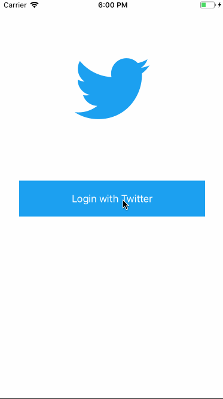

# Project 4 - *Twatter*

**Twatter** is a basic twitter app to read and compose tweets the [Twitter API](https://apps.twitter.com/).

Time spent: **25** hours spent in total

## User Stories

The following **required** functionality is completed:

- [x] User sees app icon in home screen and styled launch screen
- [x] User can sign in using OAuth login flow
- [x] User can Logout
- [x] User can view last 20 tweets from their home timeline
- [x] In the home timeline, user can view tweet with the user profile picture, username, tweet text, and date.
- [x] User can pull to refresh.
- [x] User can tap the retweet and favorite buttons in a tweet cell to retweet and/or favorite a tweet.
- [x] User can compose a new tweet by tapping on a compose button.
- [x] Using AutoLayout, the Tweet cell should adjust its layout for iPhone 7, Plus and SE device sizes as well as accommodate device rotation.
- [x] The current signed in user will be persisted across restarts

The following **optional** features are implemented:

- [x] User should display the relative timestamp for each tweet "8m", "7h"
- [x] User should be able to unretweet and unfavorite and should decrement the retweet and favorite count. 
- [x] After creating a new tweet, a user should be able to view it in the timeline immediately without refetching the timeline from the network.

The following **additional** features are implemented:

- [x] Timestamp ("8m", "7h") only displays if tweet is less than a week old; otherwise date is displayed
- [x] Timestamp/date appears right next to handle; if handle is too long, the date is still displayed all the way to the right and the handle is not fully displayed
- [x] The retweet and favorite counts round to the first decimal place when in the thousands, and display the letter "k" to indicate that they are rounded

Please list two areas of the assignment you'd like to **discuss further with your peers** during the next class (examples include better ways to implement something, how to extend your app in certain ways, etc):

1. How to add a slide side menu that appears when clicking on the profile picture in the top left, like in actual Twitter and in several other apps. 
2. How to toggle between multiple accounts. 

## Video Walkthrough

Here's a walkthrough of implemented user stories:

GIF created with [LiceCap](http://www.cockos.com/licecap/).

## Notes

Describe any challenges encountered while building the app.

One of the larger challenges was figuring out how AutoLayout worked, especially in changing the table cell size so that all of the text of the tweet displays, but once I figured that out, I started getting the hang of it and could figure out how to use AutoLayout without any outside help. 

## Credits

List an 3rd party libraries, icons, graphics, or other assets you used in your app.

- [AFNetworking](https://github.com/AFNetworking/AFNetworking) - networking task library

## License

Copyright [2018] [Tarini Singh]

Licensed under the Apache License, Version 2.0 (the "License");
you may not use this file except in compliance with the License.
You may obtain a copy of the License at

http://www.apache.org/licenses/LICENSE-2.0

Unless required by applicable law or agreed to in writing, software
distributed under the License is distributed on an "AS IS" BASIS,
WITHOUT WARRANTIES OR CONDITIONS OF ANY KIND, either express or implied.
See the License for the specific language governing permissions and
limitations under the License.
